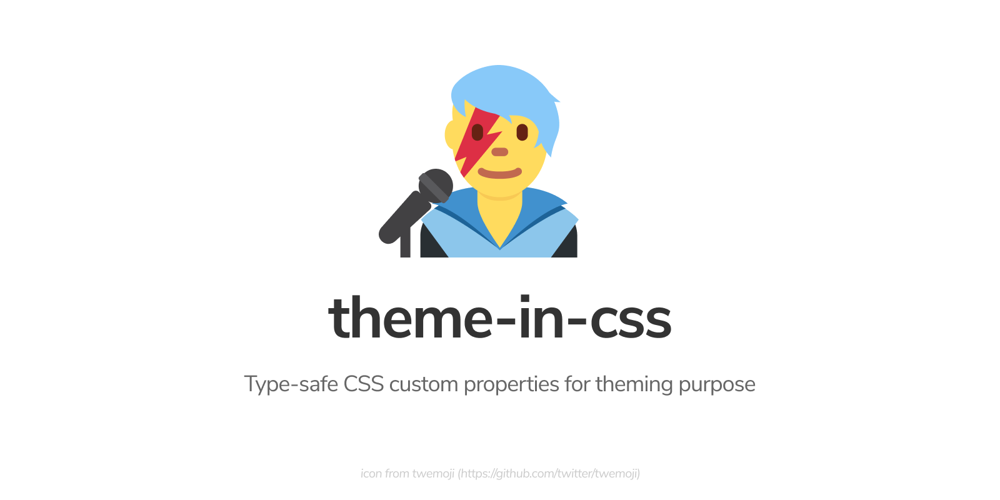

<!-- markdownlint-disable MD026 MD033 MD041 -->

<div align="center">

[](.)

[](https://www.npmjs.com/package/theme-in-css)
[](https://www.npmjs.com/package/theme-in-css)

</div>

---

- [Why?](#why)
- [Usage](#usage)
- [CSS Integration](#css-integration)
  - [.css.string: `string`](#cssstring-string)
  - [.css.properties: `Array<[key: string, value: string]>`](#cssproperties-arraykey-string-value-string)
- [License](#license)

---

## Why?

- **Strictly-typed design token, no more typo**. As you might know: CSS is forgiving, but in this case we don't want that. We want it to fail at compile time and this library gives you that
- **Works in CSS and JS**. Using CSS custom properties means you can reference your design token in both CSS and JS. Separation of concern!
- **Library agnostic**. The only purpose of this library is to provide type-safe CSS custom properties in your TS modules, nothing less, nothing more.

## Usage

First create your theme object, you can group theme variables by its function (color, spacing, etc). Think of it as design token.

```ts
import { createTheme } from 'theme-in-css';

export const Theme = createTheme({
  color: {
    lightPrimary: '#fff',
    darkPrimary: '#000',
  },
  spacing: {
    xs: 2,
    s: 4,
    m: 8,
    l: 16,
    xl: 32,
  },
});

// If you hate typing you can also use a shorter property name
// const t = createTheme({ c: { l1: '#fff', d1: '#000' } });
```

Then you can use this theme in your component, in this example we use React but it can also be used in any UI libraries:

```tsx
import * as React from 'react';
import { Theme } from './theme';

function Component() {
  return (
    <div
      style={{
        backgroundColor: Theme.color.darkPrimary,
        color: Theme.color.lightPrimary,
        margin: Theme.spacing.m,
      }}
    >
      <h1>It works</h1>
    </div>
  );
}
```

## CSS Integration

If you only create theme and use them in your app, you'll notice that your app now uses CSS variables to reference a value, but it doesn't work properly yet because you need to add the CSS into your stylesheet.

### .css.string: `string`

`theme-in-css` provides `.css.string` property to dump the theme values as CSS properties. You can create 2 themes light and dark and dump them in different style declaration, like this:

```ts
import { Theme, DarkTheme } from './theme';

const html = `
<!doctype head>
<html>
  <head>
    <style>
      :root {
        ${Theme.css.string}
      }

      @media (prefers-color-scheme: dark) {
        ${DarkTheme.css.string}
      }
    </style>
  </head>
  <body>
  </body>
</html>
`;
```

You can open [example](example) to see it in action.

### .css.properties: `Array<[key: string, value: string]>`

You can also use `.css.properties` if you want to update the CSS custom property manually using JS.

```js
const root = document.documentElement;

theme.css.properties.forEach(([key, value]) => {
  root.style.setProperty(key, value);
});
```

If you prefer `Record<string, string>` instead, you can use `Object.fromEntries`

```js
const obj = Object.fromEntries(theme.css.properties);
```

## License

MIT
